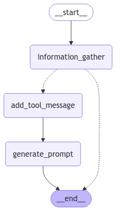

[English](README.en.md) | [한국어](README.ko.md)

# Meta-Prompt Generator

LangGraph를 활용한 대화형 프롬프트 생성 챗봇으로, 사용자와의 대화를 통해 최적화된 프롬프트를 생성합니다. 


## 핵심 기능

- LLM 기반 대화형 메타 프롬프트 생성 및 최적화
- Server-Sent Events(SSE)를 활용한 실시간 스트리밍 응답
- Streamlit 기반의 반응형 웹 인터페이스

## 아키텍처



이 다이어그램은 시스템의 상태 기반 워크플로우를 보여줍니다:
1. **Information Gathering**: 사용자 요구사항 수집 및 분석
2. **Tool Message Processing**: 중간 처리 및 상태 업데이트
3. **Prompt Generation**: 최적화된 메타 프롬프트 생성

## 기술 스택

- 🐍 Python 3.11+ (타입 힌팅 및 최신 비동기 기능 지원)
- ⚡ FastAPI (비동기 API 엔드포인트 및 SSE 스트리밍)
- 🔄 LangGraph (상태 기반 워크플로우 관리)
- 🦜 LangChain (LLM 통합 및 프롬프트 관리)
- 🎈 Streamlit (대화형 웹 인터페이스)
- 🐳 Docker (컨테이너화 및 배포)

## 시작하기

### 로컬 환경에서 실행

1. uv 패키지 관리자 설치
```bash
# Windows (PowerShell)
powershell -ExecutionPolicy ByPass -c "irm https://astral.sh/uv/install.ps1 | iex"

# Linux/macOS
curl -LsSf https://astral.sh/uv/install.sh | sh
```

2. 프로젝트 설정
```bash
# 저장소 클론
git clone https://github.com/haesung-j/meta-prompt.git
cd meta-prompt

# 가상환경 생성 및 의존성 설치
uv python install 3.11
uv venv --python=3.11
uv sync

# 환경 변수 설정
cp .env.example .env
# .env 파일을 편집하여 필요한 API 키 설정
```

3. 서버 실행
```bash
bash start.sh
```

### Docker로 실행

```bash
# 이미지 빌드
docker build -t meta-prompt .

# 컨테이너 실행 (연결된 포트에 주의)
docker run -p 8501:8501 --name meta-prompt meta-prompt
```

## 사용 방법

1. 웹 브라우저에서 `http://localhost:8501` 접속
2. 채팅 인터페이스에서 프롬프트 생성 요구사항 입력
   - 프롬프트의 목적 설명
   - 필요한 변수 정의
   - 출력 제약조건 설정
3. 실시간으로 생성되는 프롬프트 확인 및 피드백 제공
4. 최종 프롬프트를 복사하여 사용

## API 엔드포인트

- GET `/chat/stream`: 스트리밍 채팅 API (SSE 기반)
  - Parameters:
    - `query`: 사용자 입력 텍스트 (필수)
    - `thread_id`: 채팅 스레드 ID (선택, 기본값은 자동생성)
  - Response: `text/event-stream` 형식의 스트리밍 응답

## 환경 변수

`.env` 파일에 다음 환경 변수를 설정해야 합니다:

```
OPENAI_API_KEY=your_openai_api_key  # OpenAI API 키 (필수)
MODEL_NAME=gpt-4o                   # 사용할 모델 (기본값: gpt-4o)
TEMPERATURE=0.7                     # 생성 다양성 설정 (0.0-1.0)
```
