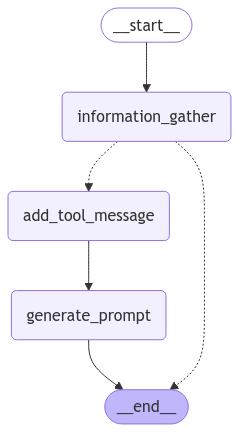

# Meta-Prompt Generator

LangGraph를 활용한 대화형 메타 프롬프트 생성 시스템입니다. 이 시스템은 사용자와의 대화를 통해 최적화된 프롬프트를 생성하고, 생성된 프롬프트를 실시간으로 확인할 수 있는 웹 인터페이스를 제공합니다.

## 주요 기능

- 🤖 대화형 메타 프롬프트 생성
- 🌊 실시간 스트리밍 응답
- 📝 프롬프트 최적화 및 검증
- 🎯 맞춤형 프롬프트 템플릿 생성
- 🔄 LangGraph 기반의 프롬프트 처리 파이프라인
- 🌐 Streamlit 기반의 웹 인터페이스

## 시스템 아키텍처



## 기술 스택

- 🐍 Python 3.11+
- ⚡ FastAPI
- 🔄 LangGraph
- 🦜 LangChain
- 🎈 Streamlit
- 🐳 Docker

## 시작하기

### 로컬 환경에서 실행

1. 환경 설정
```bash
# 저장소 클론
git clone https://github.com/yourusername/meta-prompt-generator.git
cd meta-prompt-generator

# 가상환경 생성
python -m venv venv
source venv/bin/activate  # Windows: venv\Scripts\activate

# 의존성 설치
pip install -r requirements.txt

# 환경 변수 설정
cp .env.example .env
# .env 파일을 편집하여 필요한 API 키 설정
```

2. 서버 실행
```bash
# FastAPI 서버 실행
uvicorn main:app --reload --port 8000

# 새로운 터미널에서 Streamlit 앱 실행
streamlit run app.py
```

### Docker로 실행

```bash
# 이미지 빌드
docker build -t meta-prompt-generator .

# 컨테이너 실행
docker run -p 8000:8000 -p 8501:8501 meta-prompt-generator
```

## 사용 방법

1. 웹 브라우저에서 `http://localhost:8501` 접속
2. 채팅 인터페이스에서 프롬프트 생성 요구사항 입력
3. 실시간으로 생성되는 프롬프트 확인 및 수정

## API 엔드포인트

- GET `/chat/stream`: 스트리밍 채팅 API
  - Parameters:
    - `query`: 사용자 입력 텍스트
    - `thread_id`: 채팅 스레드 ID (선택사항)

## 프로젝트 구조

```
.
├── app.py              # Streamlit 웹 인터페이스
├── main.py            # FastAPI 서버
├── graph/             # LangGraph 관련 코드
│   ├── graph.py      # 메인 그래프 정의
│   ├── nodes.py      # 그래프 노드 정의
│   └── edges.py      # 그래프 엣지 정의
├── prompts/          # YAML 형식의 프롬프트 템플릿
├── requirements.txt  # 프로젝트 의존성
├── Dockerfile       # 컨테이너화 설정
└── README.md       # 프로젝트 문서
```

## 환경 변수

`.env` 파일에 다음 환경 변수를 설정해야 합니다. 기본값은 gpt-4o 입니다.

```
OPENAI_API_KEY=your_openai_api_key
MODEL_NAME=gpt-4o
TEMPERATURE=0.7
```
